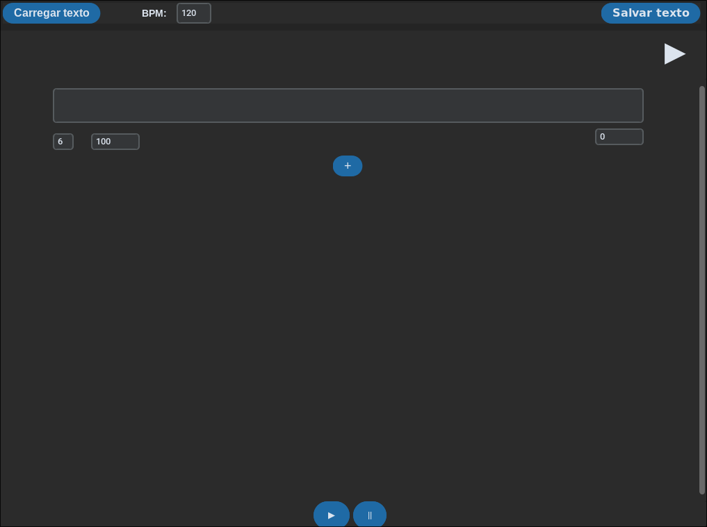

# Gerador de música

## Setup

### Criando um ambiente virtual

    python -m venv path/to/venv

### Acessando o ambiente virtual:

#### Windows:

    ./path/to/venv\Scripts\activate

#### Linux

    source /path/to/venv/bin/activate

### Dependências:

    pip install -r requirements.txt

## How to Run

    python src/main.py

## DOCS

### Estrutura

    .
    ├── assets
    ├── build
    ├── docs
    ├── src
    │   ├── core
    │   │   └── characteres
    │   └── ui
    └── tests

#### Assets

Contém um arquivo soundfont para conversão do arquivo midi.

#### Docs

Documentação geral do trabalho. A relação entre as classes pode ser achada lá

#### Src

Diretório do código fonte

- **Core**: Arquivos responsáveis pelas classes do núcleo do sistema
    - **Characteres**: Contém os tipos de characteres
- **Ui**: Contém a camada da interface do usuário

### Testes(WIP)

testes unitários realizados para verificar consistência dos parâmetros.
testes manuais realizados para verificar a reprodução correta.
